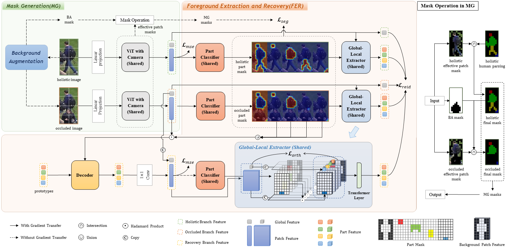
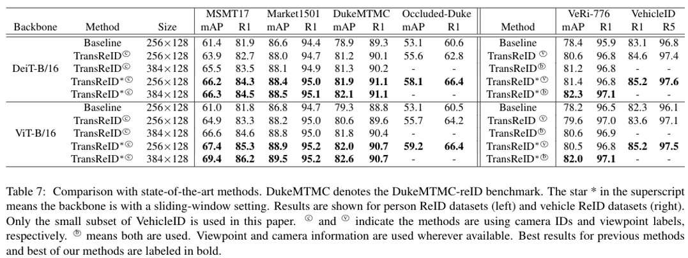

## **MFER: Mask-Guided Feature Extraction and Recovery Network for Occluded Person Re-identification**

## Pipeline


## Requirements

### Environment
We use conda to create our environment.
```bash
conda create -n reid python=3.8
conda activate reid
conda install pytorch torchvision torchaudio pytorch-cuda=12.1 -c pytorch -c nvidia
pip install yacs
pip install timm
pip install scikit-image
pip install tqdm
pip install ftfy
pip install regex
pip install opencv-python
pip install einops
pip install matplotlib
```

### Prepare Datasets

```bash
mkdir datasets
```

Download the person datasets [Occluded-Duke](https://github.com/lightas/Occluded-DukeMTMC-Dataset). Then unzip it and rename it under the directory.


### Prepare ViT and Human Parsing Net Pre-trained Model

You need to download the ImageNet pretrained transformer model : [ViT-Base](https://github.com/rwightman/pytorch-image-models/releases/download/v0.1-vitjx/jx_vit_base_p16_224-80ecf9dd.pth)

## Training

We utilize single RTX V100 GPU for training. You can directly train with following  yml and commands:

```bash

# OCC_Duke
python train.py --config_file configs/OCC_Duke/mfer.yml MODEL.DEVICE_ID "('0')"
# smaller stride
python train.py --config_file configs/OCC_Duke/mfer_stride.yml MODEL.DEVICE_ID "('0')"
```


## Evaluation

```bash
# OCC_Duke
python test.py --config_file configs/OCC_Duke/vit_transreid_stride.yml MODEL.DEVICE_ID "('0')" TEST.WEIGHT '../logs/occ_duke_vit_transreid_stride/transformer_120.pth'
```

<!-- ## Experiment results and logs

<!--  -->

Note: We reorganize code and the performances are slightly different from the paper's. -->

## Acknowledgement

Our code is extended from the following repositories. We thank the authors for releasing the codes.

- [TransReID](https://github.com/damo-cv/TransReID)
- [ViTAA](https://github.com/Jarr0d/ViTAA)
