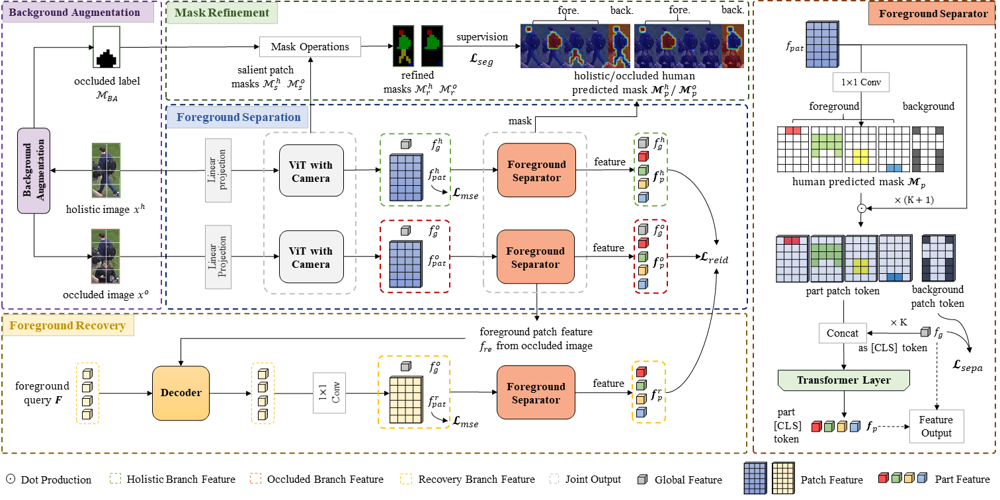
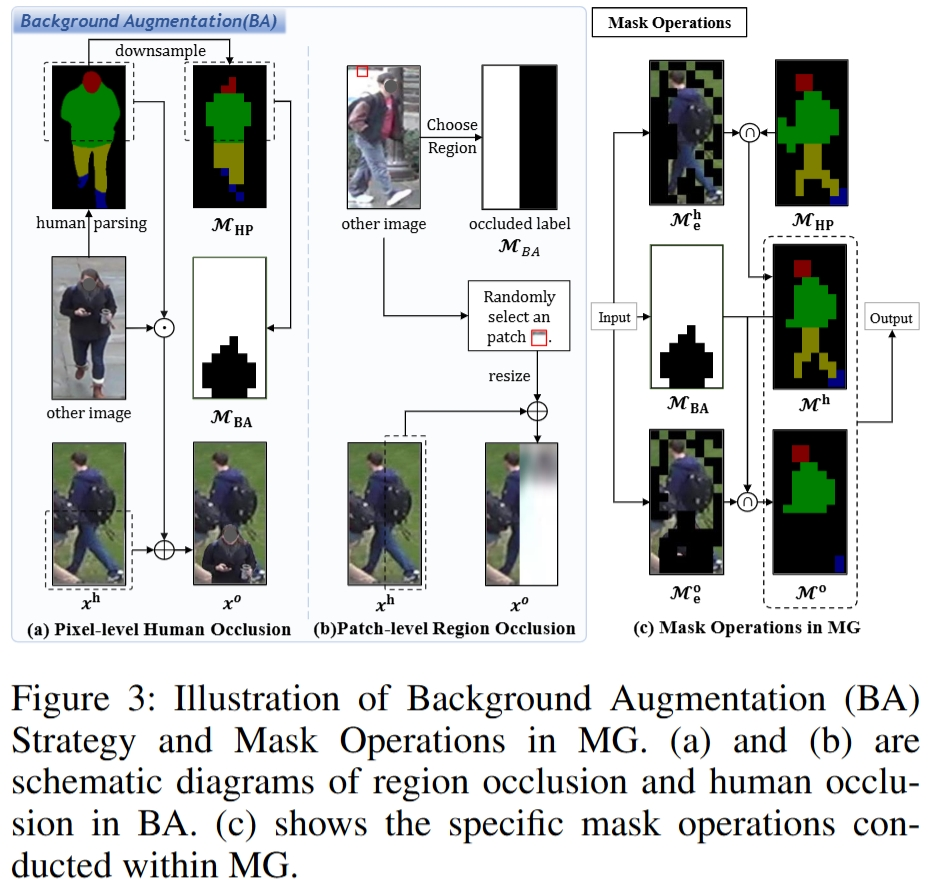
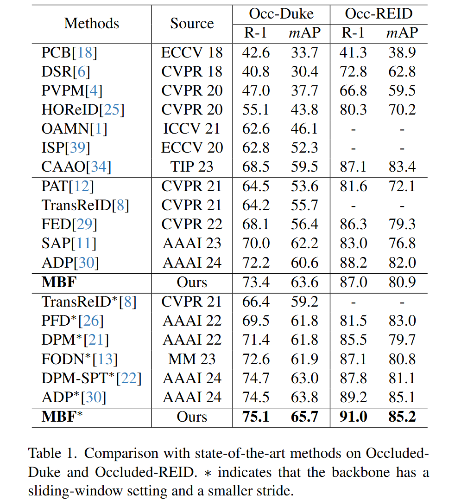

## **MBF: Mask-Guided Background Augmentation and Foreground Extraction Network for Occluded Person Re-identification**

Code of paper "Mask-Guided Background Augmentation and Foreground Extraction Network for Occluded Person Re-identification"

## Pipeline


## Requirements

### Installation
```bash
pip install -r requirement.txt
```

### Prepare Datasets

```bash
mkdir datasets
```

Download the person datasets [Market-1501](https://drive.google.com/file/d/0B8-rUzbwVRk0c054eEozWG9COHM/view), [DukeMTMC-reID](https://arxiv.org/abs/1609.01775),[Occluded-Duke](https://github.com/lightas/Occluded-DukeMTMC-Dataset).
Then unzip them and rename them under the directory like

```
datasets
├── market1501
│   └── images ..
├── DukeMTMC-reID
│   └── images ..
├── Occluded_Duke
│   └── images ..
└── Occluded_REID
    └── images ..
```
Then unzip them and rename them under the directory.


### Prepare ViT Pre-trained Model and Human Parsing Network Weight

You need to download the ImageNet pretrained transformer model and human parsing model: [pre_weights](https://drive.google.com/drive/folders/1BWx5m0bEf7dFYbk_jUoUBYk-aQ9hsWP1?usp=drive_link)
Then rename their pathes in 'MODEL.PRETRAIN_PATH' and 'HUMAN_PARSING.MODEL_FILE'.

## Training

We utilize single RTX V100 GPU for training. You can directly train with following  yml and commands:

```bash

# Training on Occluded-Duke
python train.py --config_file configs/OCC_Duke/mbf.yml MODEL.DEVICE_ID "('2')"
# smaller stride
python train.py --config_file configs/OCC_Duke/mbf_stride.yml MODEL.DEVICE_ID "('2')"

# Training on Occluded-ReID
python train.py --config_file configs/OCC_reid/mbf.yml MODEL.DEVICE_ID "('2')"
# smaller stride
python train.py --config_file configs/OCC_reid/mbf_stride.yml MODEL.DEVICE_ID "('2')"

# Training on Market-1501
python train.py --config_file configs/Market/mbf.yml MODEL.DEVICE_ID "('2')"
# smaller stride
python train.py --config_file configs/Market/mbf_stride.yml MODEL.DEVICE_ID "('2')"

# Training on DukeMTMC-reID
python train.py --config_file configs/DukeMTMC/mbf.yml MODEL.DEVICE_ID "('2')"
# smaller stride
python train.py --config_file configs/DukeMTMC/mbf_stride.yml MODEL.DEVICE_ID "('2')"
```

## Evaluation

```bash
# OCC_Duke
python test.py --config_file configs/OCC_Duke/mbf.yml
# OCC_REID
python test.py --config_file configs/OCC_reid/mbf.yml
# Market-1501
python test.py --config_file configs/Market/mbf_stride.yml
# DukeMTMC-reID
python test.py --config_file configs/DukeMTMC/mbf_stride.yml
```

## Experiment results




## Acknowledgement

Our code is extended from the following repositories. We thank the authors for releasing the codes.

- [TransReID](https://github.com/damo-cv/TransReID)
- [ViTAA](https://github.com/Jarr0d/ViTAA)
